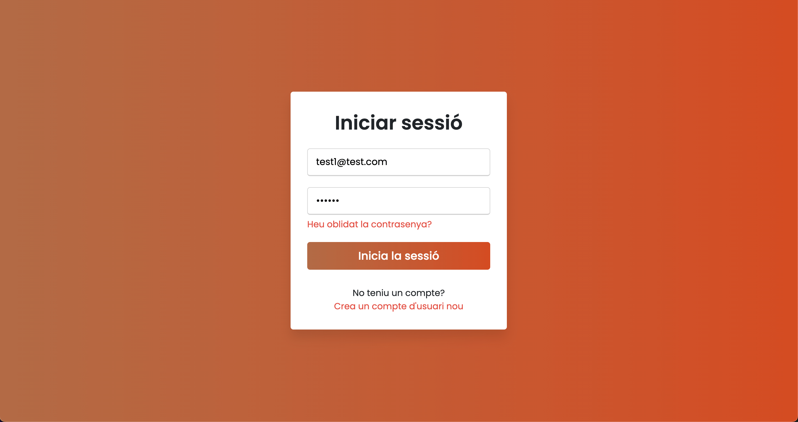
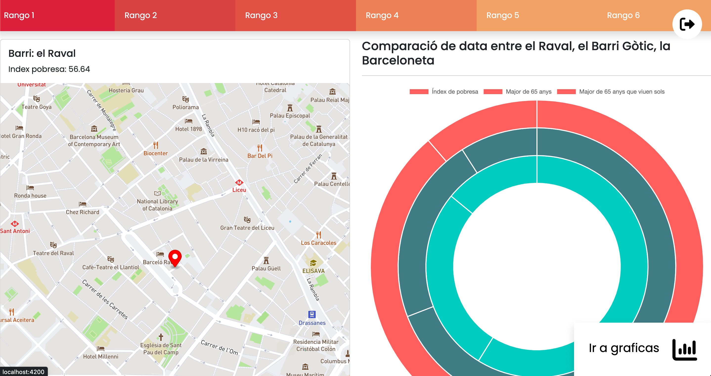

# Hackathon Jornada de Talent Digital

[Back-End Repo](https://github.com/ErnestCV/UsAcompanyem-Backend)

[Data Science Repo](https://github.com/carlyjb17/data_hackathon)

---

## :wrench: **Tecnologies utilitzades**


## **Pàgines d'exemple**

## 
## 

## :memo: **Pendent**

1. Sistema de ranking de barri més pobre a menys.

2. Comparativa de barris en index de pobresa, persones major de 65 anys i persones majors de 65 que viuen soles.

3. Utilitzar filtres per barri.

4. Disenyar i estilitzar la web.


## :seedling: **Getting Started with this project**

This project was generated with [Angular CLI](https://github.com/angular/angular-cli) version 14.0.6.

## Development server

Run `ng serve` for a dev server. Navigate to `http://localhost:4200/`. The application will automatically reload if you change any of the source files.

## Installation

Clone or fork the Repo, and ensure that you have the [Angular CLI](https://github.com/angular/angular-cli) installed.

In the project directory.

```bash
npm install
```

In the project directory.

```bash
ng serve --open or ng s -o
```

## Contributing

Pull requests are welcome. For major changes, please open an issue first to discuss what you would like to change.

Please make sure to update tests as appropriate.

## License

[MIT](https://choosealicense.com/licenses/mit/)

## Further help

To get more help on the Angular CLI use `ng help` or go check out the [Angular CLI Overview and Command Reference](https://angular.io/cli) page.

This project was generated with [Angular CLI](https://github.com/angular/angular-cli) version 14.0.6.
